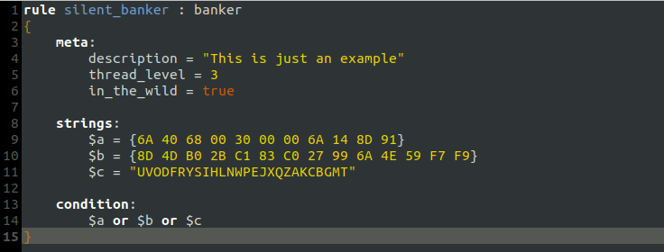

# GtkSourceView-YARA

**Note:** This language has been merged upstream into the official [GtkSourceView project](https://gitlab.gnome.org/GNOME/gtksourceview), and is no longer maintained here.

#

This package provides [YARA](https://virustotal.github.io/yara/) syntax highlighting for Gtk-based text editors such as gedit and [xed](https://github.com/linuxmint/xed)



#### To install:
Save `yara.lang` to `~/.local/share/gtksourceview-3.0/language-specs/`:

```sh
mkdir -pv ~/.local/share/gtksourceview-3.0/language-specs/
cp ./yara.lang ~/.local/share/gtksourceview-3.0/language-specs/
```
